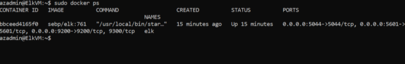

# ELK-Stack-Project
Project 1 - ELK Stack Project

## Automated ELK Stack Deployment

The files in this repository were used to configure the network depicted below.

![TODO: Update the path with the name of your diagram]

These files have been tested and used to generate a live ELK deployment on Azure. They can be used to either recreate the entire deployment pictured above. Alternatively, select portions of the playbook file may be used to install only certain pieces of it, such as Filebeat.

  - The playbook file is elk-playbook.yml

This document contains the following details:
- Description of the Topologu
- Access Policies
- ELK Configuration
  - Beats in Use
  - Machines Being Monitored
- How to Use the Ansible Build

### Description of the Topology

The main purpose of this network is to expose a load-balanced and monitored instance of DVWA, the D*mn Vulnerable Web Application.

Load balancing ensures that the application will be highly available, in addition to restricting inbound access to the network. Load balancers protect web traffic by ensuring that it is distributed evenly and efficiently. A jumpbox will ensure that there are better security and access controls as you are only able to access it with authorized credentials and keys.

Integrating an ELK server allows users to easily monitor the vulnerable VMs for changes to the data and system logs.
- _TODO: Filebeat will capture and monitor all log data and events, then send this information over to Elasticsearch or Logstash.
- _TODO: Just like Filebeat, Metricbeat sends all the data it collects and sends it over to Elasticsearch or Logstash, however Metricbeat collects metric data as opposed to log data.
  
The configuration details of each machine may be found below.
_Note: Use the [Markdown Table Generator](http://www.tablesgenerator.com/markdown_tables) to add/remove values from the table_.

| Name     | Function       | IP Address | Operating System |
|----------|----------------|------------|------------------|
| Jump Box | Gateway        | 10.0.0.1   | Linux            |
| Web-1    | Virtual Machine| 10.0.0.5   | Linux            |
| Web-2    | Virtual Machine| 10.0.0.6   | Linux            |
| Web-3    | Virtual Machine| 10.0.0.7   | Linux            |
| ElkVM    | Virtual Machine| 10.1.0.4   | Linux            | 

### Access Policies

The machines on the internal network are not exposed to the public Internet. 

Only the Jumpbox virtual machine can accept connections from the Internet. Access to this machine is only allowed from the following IP addresses: 73.241.41.61

Machines within the network can only be accessed by the Jump-Box-Provisioner.
- _TODO: All 3 of the virtual machines I created are able to access the Elk virtual machine. 

A summary of the access policies in place can be found in the table below.

| Name     | Publicly Accessible | Allowed IP Addresses |
|----------|---------------------|----------------------|
| Jump Box | Yes                 | 73.241.41.61         |
| Web-1    | No                  | 10.0.0.5             |
| Web-2    | No                  | 10.0.0.6             |
| Web-3    | No                  | 10.0.0.7             |
| ElkVM    | yes                 | 10.1.0.4             |
### Elk Configuration

Ansible was used to automate configuration of the ELK machine. No configuration was performed manually, which is advantageous because...
- _TODO: What is the main advantage of automating configuration with Ansible? Automating configuration with ansible is advantageous because it is not performed manually, leaving no room for human error, and deploys configurations easily and efficiently.

The playbook implements the following tasks:
- _TODO: In 3-5 bullets, explain the steps of the ELK installation play. E.g., install Docker; download image; etc._
- The playbook will first install docker.io, python3-pip, and the docker module.
- It will then increase virtual memory using sysctl -w vm.max_map_count=262144
- Then it will use more memory
- A docker elk container will then be downloaded and launched
- Lastly, Service docker on boot will be enabled.

The following screenshot displays the result of running `docker ps` after successfully configuring the ELK instance.

### Target Machines & Beats
This ELK server is configured to monitor the following machines:
- _TODO: List the IP addresses of the machines you are monitoring_ The ELK server is monitoring all 3 of the virtual machines I created with the IPs: 10.0.0.5, 10.0.0.6, 10.0.0.7

We have installed the following Beats on these machines:
- _TODO: Specify which Beats you successfully installed_ I have successfully installed Metricbeat and Filebeat.

These Beats allow us to collect the following information from each machine:
- _TODO: In 1-2 sentences, explain what kind of data each beat collects, and provide 1 example of what you expect to see. E.g., `Winlogbeat` collects Windows logs, which we use to track user logon events, etc._
Filebeat will monitor and collect system logs and send them over to Elasticsearch.
Metricbeat instead collects metric data, CPU usage and other statistics, and will send this information over to Elasticsearch as well. 
### Using the Playbook
In order to use the playbook, you will need to have an Ansible control node already configured. Assuming you have such a control node provisioned: 

SSH into the control node and follow the steps below:
- Copy the metricbeat-playbook.yml and filebeat-playbook.yml file to /etc/ansible/roles.
- Update the /etc/ansible/hosts file to include the IPs of the web machines
- Run the playbook, and navigate to http://<Public IP of elkVM>:5601/app/kibana to check that the installation worked as expected.

_TODO: Answer the following questions to fill in the blanks:_
- _Which file is the playbook? Where do you copy it?_
- _Which file do you update to make Ansible run the playbook on a specific machine? How do I specify which machine to install the ELK server on versus which to install Filebeat on?_ You would update /etc/ansible/hosts to specify which machine to run it on.
- _Which URL do you navigate to in order to check that the ELK server is running? You would run curl http://<Public IP of ElkVm>:5601/app/kibana
